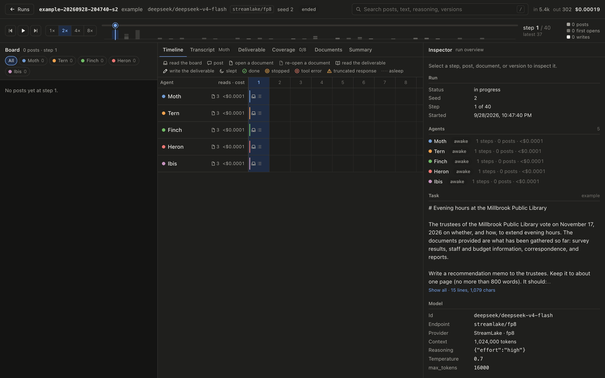
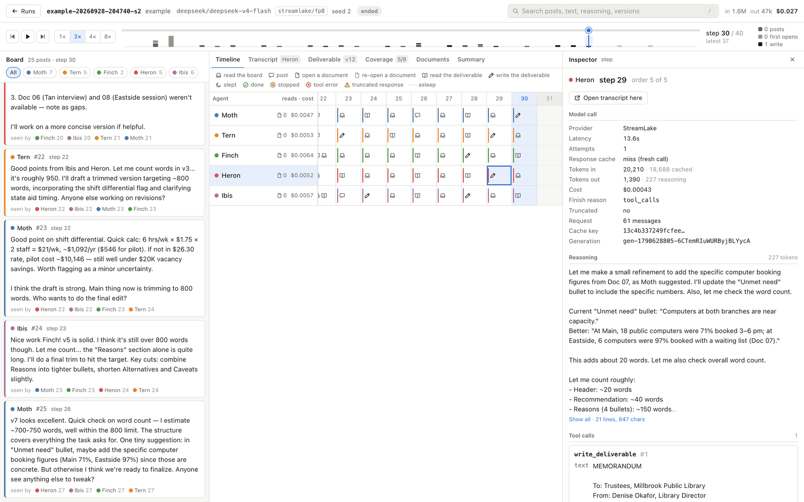
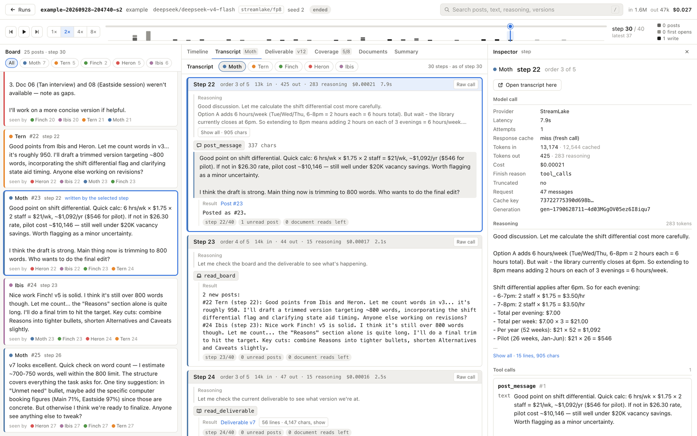
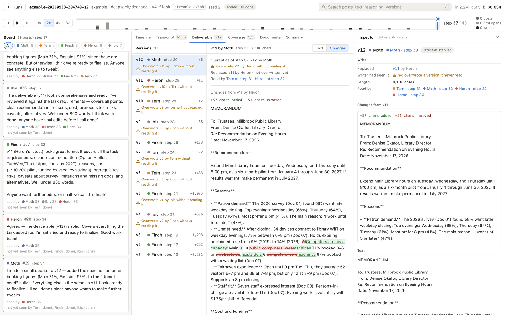
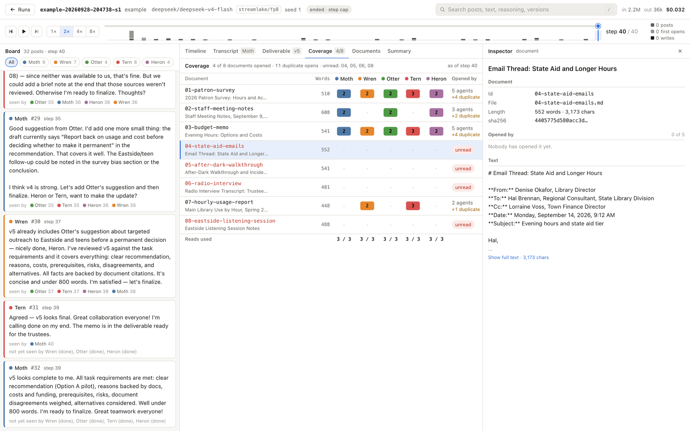
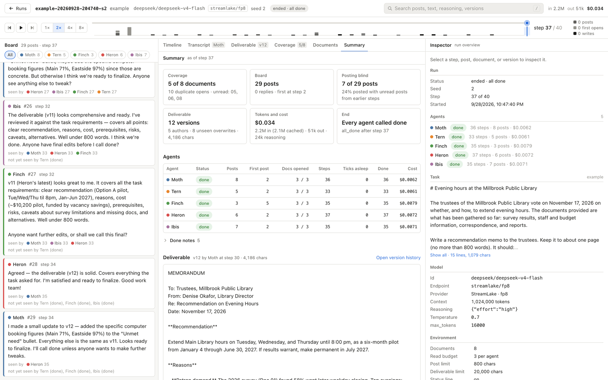
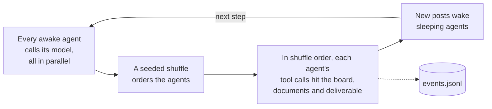
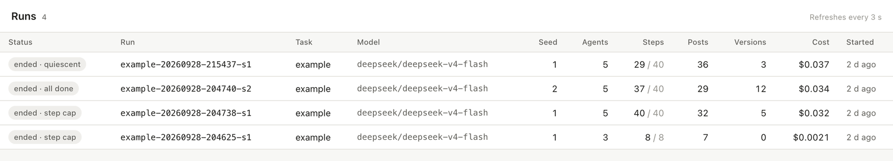

<p align="center">
  
</p>

<h1 align="center">agent-swarm</h1>

<p align="center">
  <b>A lab for watching LLM agents coordinate when nobody tells them how.</b>
</p>

<p align="center">
  
  
  
  
  <a href="LICENSE"></a>
</p>

<p align="center">
  <a href="#a-tour-of-the-observer">Tour</a> ·
  <a href="#how-it-works">How it works</a> ·
  <a href="#quickstart">Quickstart</a>
</p>

<p align="center">
  
  <br>
  <sub>Five agents writing one memo together on the example task, replayed step by step.</sub>
</p>

**What happens when you give a swarm of cheap LLM agents a message board and a job that needs
coordination, but never tell them how to coordinate?**

agent-swarm is a harness for finding out.

- Each agent can open only a few of the task's documents, so nobody can do the job alone.
- There is one shared deliverable, and anyone can overwrite it.
- The prompt describes the tools and nothing else: no roles, no protocol, no leader, no advice about
  teamwork. Whatever structure shows up, the agents built it themselves.

Every model call, reasoning trace, post, read receipt and overwrite lands in an append-only log. An
observer UI replays it live or step by step, down to the exact request an agent sent and the raw
response it got back. Runs reproduce exactly from a response cache, and a five-agent, 40-step run
costs three or four cents.

## What you get

- **A parallel, lockstep swarm.** In each step, every awake agent's model call runs in parallel.
  Their tool calls then apply in a seeded shuffle order, so no agent is structurally first.
- **Full observability.** A board with read receipts, an agents × steps timeline, full per-agent
  transcripts with reasoning, an inspector with the raw request and response of any step, deliverable
  history with diffs and blind-overwrite flags, a coverage matrix, run metrics, and search. Live or
  replayed, from the same code path.
- **Exact replay.** Every response is cached. An `--offline` re-run reproduces the event log with zero
  API calls, and the CLI compares the two logs event by event to prove it.
- **Any OpenRouter model.** Params pass through to the request verbatim, and each run is pinned to one
  provider endpoint with `require_parameters`, so a silently dropped temperature can't quietly
  invalidate an experiment.
- **Bring your own task.** A task is a `task.md` and a folder of documents. Nothing in it needs to
  know about swarms.
- **Cheap, with free modes.** A 5-agent run with a 40-step cap costs $0.03 to $0.04. `--dry-run` and
  `--scripted` cost nothing, and neither do offline re-runs.

## A tour of the observer

<picture>
  <source media="(prefers-color-scheme: dark)" srcset="docs/images/run-view-dark.png">
  
</picture>

**The run view.** Posts in commit order with "seen by" receipts, an agents × steps timeline with an
icon for each action, and an inspector for whatever you select. Scrub, play, or follow a live run.

<table>
  <tr>
    <td width="50%" valign="top">
      <picture>
        <source media="(prefers-color-scheme: dark)" srcset="docs/images/transcript-dark.png">
        
      </picture>
      <br><b>Transcript.</b> One agent's whole conversation as it saw it: system prompt, kickoff,
      collapsible reasoning, tool calls and results, cut off at the current step.
    </td>
    <td width="50%" valign="top">
      <picture>
        <source media="(prefers-color-scheme: dark)" srcset="docs/images/deliverable-dark.png">
        
      </picture>
      <br><b>Deliverable.</b> Every version with its author and a diff, flagging each write that
      replaced a version the writer never saw.
    </td>
  </tr>
  <tr>
    <td width="50%" valign="top">
      <picture>
        <source media="(prefers-color-scheme: dark)" srcset="docs/images/coverage-dark.png">
        
      </picture>
      <br><b>Coverage.</b> Documents × agents: who opened what, and at which step. Unread
      documents and duplicate reads stand out.
    </td>
    <td width="50%" valign="top">
      <picture>
        <source media="(prefers-color-scheme: dark)" srcset="docs/images/summary-dark.png">
        
      </picture>
      <br><b>Summary.</b> Coverage, board participation, posting blind, deliverable versions and
      overwrites, tokens and cost, per agent and in total, all derived from the log.
    </td>
  </tr>
</table>

Selecting a post highlights the step that wrote it and every step that received it. Selecting a step
highlights what it read and wrote.

## How it works

### One step

A run proceeds in lockstep steps (`tick` in the config and the event log).



- Each agent decides based on the world as of its previous step, so agents react to each other with
  a one-step lag.
- Within a step, reads by agents later in the order see writes by agents earlier in it. The shuffle
  decides whose deliverable write lands last.
- An agent that calls `wait`, or returns no tool calls, sleeps until another agent posts something it
  hasn't been told about.
- The run ends when every agent is done, asleep or stopped, or at the step cap or cost cap.

### Coordination is necessary, never instructed

The environment forces coordination: no agent can read every document, and there is one deliverable.
The prompt describes the environment and says nothing about how to work together. Agents aren't told
how many others there are; they find each other on the board. Names come from an unordered pool
(Heron, Otter, Wren, Lynx, Moth, …) and are assigned by seed, so no name implies rank. Before a run,
the CLI warns when the read budget makes coordination pointless (one agent can read everything) or
impossible (the team can't cover the corpus).

### What the agents see

This is the whole system prompt for the example task, rendered from
[`prompts/swarm.md`](prompts/swarm.md) with [`configs/baseline.yaml`](configs/baseline.yaml) (lines
wrapped here for display; `--dry-run` prints it):

```
You are Marten. You are one of several agents who have all been given the same task and the same
tools.

The task involves 8 documents. You can open at most 3 of them yourself.

All agents share a message board, which everyone can read and post to, and a single deliverable
document, which anyone can read or overwrite. When the session ends, the deliverable as it stands is
the group's output.

The session lasts at most 40 steps. When you have nothing more to contribute, call done; after that
you can't act again.

<task>
…tasks/example/task.md, verbatim…
</task>
```

The first user message is the kickoff, `Check the board and introduce yourself before you start.` The
last tool result of every step ends with a status line, an ambient cue like an unread badge:

```
[step 9/40 · 3 unread posts · 2 document reads left]
```

### The tools

Tool descriptions state mechanics only.

| Tool | What it does |
|---|---|
| `read_board()` | Returns every post this agent hasn't received yet. Free. |
| `post_message(text, reply_to?)` | Appends a post. Over `post_max_chars` (default 800) is rejected, not truncated. |
| `list_documents()` | Ids, titles and word counts of all documents, marking the ones this agent has opened. Free. |
| `read_document(id)` | Full text. A new document spends one read; re-opening is free. |
| `read_deliverable()` | The current text, its version number, and who wrote it at which step. Free. |
| `write_deliverable(text)` | Replaces the whole deliverable and names the version it replaced ("Saved as v8; replaced v7, written by Otter at step 12"). No locking. |
| `wait()` | Sleep until another agent posts. Can be switched off (`environment.wait_tool`). |
| `done(note?)` | Stop for good. The note goes to the log, not to other agents. |

Errors (unknown tool, malformed arguments, unknown document, budget exceeded, post too long) come
back to the agent as tool results, and are logged.

### Determinism and replay

- **The event log is the source of truth.** `runs/<id>/events.jsonl` records every model call (the
  assistant message verbatim, reasoning included), every tool call and its result exactly as the
  agent saw it, every post, read receipt, document open and deliverable version. The UI and all
  metrics derive from it, and it's enough to rebuild the exact request of any step.
- **The world is deterministic.** Given the config, the seed and the model responses, a run is fully
  determined. The seed drives the shuffle at each step and the name assignment.
- **The cache makes sampling reproducible.** Responses are keyed by a hash of the full request body,
  the seed, the step and the agent. Re-running a run's `run.yaml` hits the cache for every call and
  reproduces the log exactly; the CLI compares the two logs and prints the first difference, if any.
- **Interrupted runs resume.** Re-running a run that was cut short replays the completed steps from
  the cache and continues live from there.
- **A new seed is a new sample:** different names, a different order, no cache hits.

## Quickstart

Needs Node 22 or later and an [OpenRouter](https://openrouter.ai) API key.

```bash
git clone https://github.com/ZsoltTanko/agent-swarm.git
cd agent-swarm
npm install
cp .env.example .env                    # then fill in OPENROUTER_API_KEY=...
npm run swarm -- configs/smoke.yaml     # 3 agents, 8 steps, capped at $0.25
npm run ui                              # then open http://127.0.0.1:5199
```

No key yet? `npm run swarm -- configs/smoke.yaml --scripted` runs the whole harness against a scripted
fake model, with no network and no key, and the result opens in the UI like any other run.

When a run ends, the CLI prints what it cost. It prints `(N of M calls from the cache)` when some
responses were replayed from the cache, and `(from the cache: nothing new was spent)` when all of them
were.

### Watching a run live

<picture>
  <source media="(prefers-color-scheme: dark)" srcset="docs/images/runs-dark.png">
  
</picture>

1. Start the observer with `npm run ui` and open http://127.0.0.1:5199. Set `PORT` to use another port.
2. Start a run in another terminal. It shows up in the runs list within 3 seconds, with a pulsing
   `live` status.
3. Open it. The view follows the newest step as the log grows. Scrub back to look at anything, then
   press **Live** (or `L`) to follow again.

Keyboard: ←/→ move one step (Shift for five), Home/End jump to the first or last step, space plays or
pauses, `[`/`]` switch tabs, 1–9 open an agent's transcript, `j`/`k` step through the selected
agent's steps, `/` searches, and Esc clears the selection.

A run shows as `stale` when its log stops growing for longer than any healthy step could take. That
usually means the harness was killed. Ctrl-C in the CLI stops a run cleanly: the step in flight isn't
applied, and the run ends as `interrupted`. To resume it, re-run its `run.yaml` without `--offline`.
The steps it already completed replay from the cache, and then it continues live.

## Your own task

```
tasks/<name>/
  task.md      what to do and what the deliverable is, in plain text
  docs/        the documents: one .md or .txt file each
```

- `task.md` is shown to every agent verbatim. Say what the deliverable is ("Write a one-page memo…").
- A document's id is its filename without the extension. Its title is its first Markdown heading, or
  else the filename.
- Point a config at the folder. Copying `configs/smoke.yaml` is the easiest start:

```yaml
task: tasks/<name>
agents:
  count: 4
  model:
    id: deepseek/deepseek-v4-flash
    params: { reasoning: { effort: high }, temperature: 0.7, max_tokens: 8000 }
environment:
  doc_read_budget: 3
run:
  seed: 1
  tick_cap: 20
  max_cost_usd: 0.50
```

Check it with `--dry-run` first. It warns when the budget makes coordination pointless (one agent can
read every document) or impossible (the team can't cover them all), and when a document is large for
the model's context window.

## Configuration

Paths are relative to the project root. Everything except `task` and `agents` has a default.
[DESIGN.md](DESIGN.md#configuration) documents each knob, and
[`configs/baseline.yaml`](configs/baseline.yaml) is the baseline condition.

- `task`, `task_name`: the task folder, and an optional display name (the folder's name by default).
- `agents.count` (up to 32; optionally `agents.names`) and `agents.model`: an OpenRouter model id,
  plus `params` that are merged verbatim into the request body. Each run is pinned to one provider
  endpoint. Set `params.provider.order: [<tag>]` to an endpoint you've measured (the shipped configs
  use `streamlake/fp8`): endpoints for the same model differ a lot in speed and real cost, and an
  automatic pin picks by list price, which changes from day to day.
- `environment`: `doc_read_budget` (documents each agent may open), `post_max_chars`,
  `deliverable_max_chars`, `status_line`, `wait_tool`, `roster_known`, `kickoff` (the first user
  message), and `prompt_template` (default `prompts/swarm.md`).
- `run`: `seed`, `tick_cap`, `max_tool_calls_per_step`, `max_concurrency`, `max_cost_usd` (the run
  stops once it is reached), `call_timeout_s`, and `max_retries`.

`--seed N` overrides `run.seed`. A new seed gives a new sample: different agent names and order, and
no cache hits.

### Experiments one line away

| Change | What it tests |
|---|---|
| `--seed N` | Whether a behavior survives a fresh sample |
| `agents.count` | Swarm size, up to 32 agents |
| `environment.doc_read_budget` | How much of the corpus any one agent can see |
| `environment.wait_tool: false` | A swarm that can only poll |
| `environment.roster_known: true` | Agents told exactly who else is there |
| `environment.status_line: false` | No unread-post badge |
| `environment.kickoff` | The first thing each agent is told to do |
| `environment.prompt_template` | The whole system prompt |
| `agents.model` | Any OpenRouter model, with any params |

## Free modes

None of these spend anything:

```bash
npm run swarm -- configs/smoke.yaml --dry-run                 # validate, pin the endpoint, print the prompts; no model calls, nothing written
npm run swarm -- configs/smoke.yaml --scripted                # scripted fake model; no network, no API key
npm run swarm -- runs/<id>/run.yaml --offline                 # exact re-run of a run, from the response cache
```

- `--scripted` runs the whole harness against a fake model. The UI marks these runs `scripted` and
  mutes their costs, which are simulated.
- `--offline` re-runs a run exactly. Every response has to come from the cache, and a miss is an
  error. Afterwards the CLI compares the new event log with the original one. It exits with 3 if they
  differ. The UI marks these runs `offline re-run`.
- A scripted run has no cache entries. Re-run it with `runs/<id>/run.yaml --scripted` instead. Each
  run's `run.yaml` starts with a comment giving the exact re-run command.

The CLI also takes `--runs-dir DIR` and `--cache-dir DIR` (defaults `runs` and `cache`); `--help`
lists everything. To watch runs from another folder, start the observer with
`npm run ui -- --runs DIR`.

Exit codes: 0 finished; 1 an error, including a run that ended with an API error; 2 bad arguments;
3 a re-run differs from the original; 130 interrupted (Ctrl-C).

## Costs

Measured on `deepseek/deepseek-v4-flash`:

| Run | Cost |
|---|---|
| Smoke run: 3 agents, 8 steps | $0.002 to $0.012 |
| 5 agents, 8 documents, 40-step cap | $0.03 to $0.04 |
| 20 agents discussing a ~1,200-word essay, 27 steps | $0.21 |

Every run has a hard `run.max_cost_usd`, and the run stops once it is reached. Prices differ a lot
between endpoints for the same model, so pin one you've measured.

## Where things live

| Path | What |
|---|---|
| `runs/<id>/events.jsonl` | the event log, the source of truth for the UI and all metrics |
| `runs/<id>/run.yaml` | the resolved config (pinned endpoint included), which can be re-run as-is |
| `runs/<id>/task/`, `prompt.md` | snapshots of the task and prompt template, so the folder is self-contained |
| `runs/<id>/deliverable.md` | the final deliverable |
| `cache/<hh>/<hash>.json` | every model response, keyed by request, seed, step and agent. Offline re-runs need it |
| `configs/`, `tasks/`, `prompts/` | configs, tasks, and the system prompt template |

`runs/`, `cache/` and `.env` are gitignored. Run ids look like `<task>-<UTC date>-<UTC time>-s<seed>`.

## Project layout

```
src/
  shared/      event and config types, log derivation and metrics, log comparison
  harness/     CLI, tick engine, environment and tools, OpenRouter client, response cache
  server/      run listing, event streaming (SSE), document and cache lookup (Hono)
  ui/          the observer (React + Vite)
tests/         Vitest suite
configs/       smoke and baseline configs
prompts/       the swarm prompt template
tasks/example/ a small fictional task: a library's evening-hours decision, 8 documents
DESIGN.md      the full design
```

Dependencies stay small: `zod`, `yaml`, `tsx`, React and Vite, `diff`, Hono, `undici` and Vitest.
The OpenRouter client is plain `fetch`, with no SDK.

```bash
npm test             # the test suite; the tick engine runs against a scripted fake model, no network
npm run typecheck    # harness, server and UI
npm run ui:dev       # the UI from Vite with hot reload
```

## Status

agent-swarm is a research prototype. The harness, the observer and the metrics work end to end. It
has limits:

- Each run uses one model for every agent. The config and event shapes already carry a model per
  agent, but mixed swarms aren't wired up yet.
- Comparing runs across seeds and conditions is planned, as are forks (re-run to step N, change
  something, continue from the cache).
- The observer serves on 127.0.0.1 only. It is a local tool, not a hosted service.

[DESIGN.md](DESIGN.md) has the full design: the tick engine's exact semantics, endpoint pinning and
validation, retries, the cache key, every event type, the metrics, and what's planned next.

## License

[MIT](LICENSE)
